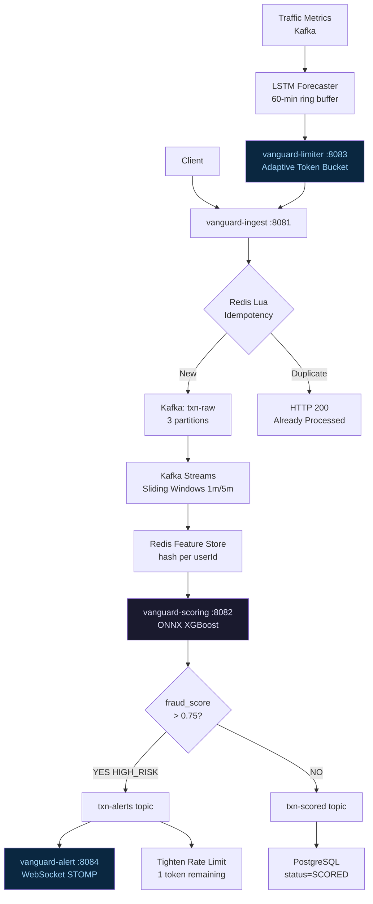

<div align="center">

```
██╗   ██╗ █████╗ ███╗   ██╗ ██████╗ ██╗   ██╗ █████╗ ██████╗ ██████╗
██║   ██║██╔══██╗████╗  ██║██╔════╝ ██║   ██║██╔══██╗██╔══██╗██╔══██╗
██║   ██║███████║██╔██╗ ██║██║  ███╗██║   ██║███████║██████╔╝██║  ██║
╚██╗ ██╔╝██╔══██║██║╚██╗██║██║   ██║██║   ██║██╔══██║██╔══██╗██║  ██║
 ╚████╔╝ ██║  ██║██║ ╚████║╚██████╔╝╚██████╔╝██║  ██║██║  ██║██████╔╝
  ╚═══╝  ╚═╝  ╚═╝╚═╝  ╚═══╝ ╚═════╝  ╚═════╝ ╚═╝  ╚═╝╚═╝  ╚═╝╚═════╝
```

**Real-time fraud intelligence with adaptive rate limiting**

[](https://openjdk.org/projects/jdk/21/)
[](https://spring.io/projects/spring-boot)
[](https://kafka.apache.org/)
[](https://redis.io/)
[](https://onnxruntime.ai/)
[]()
[]()
[](LICENSE)

[Overview](#-overview) • [Architecture](#-architecture) • [ML Pipeline](#-ml-pipeline) • [Quick Start](#-quick-start) • [API Reference](#-api-reference) • [Performance](#-performance) • [Interview Guide](#-interview-guide)

</div>

---

## Overview

VANGUARD is a production-grade **real-time fraud detection and adaptive rate limiting platform** built on a microservices architecture. Every financial transaction is scored by an embedded XGBoost model (via ONNX Runtime) in under 5ms. An LSTM neural network continuously forecasts traffic patterns and dynamically adjusts rate limits before spikes hit.

> *"Guard at your back — protecting every transaction before it clears."*

### What makes VANGUARD different

| Capability | Implementation | Why it matters |
|---|---|---|
| **Sub-5ms inference** | ONNX Runtime embedded in JVM | No network hop vs Python microservice |
| **Atomic idempotency** | Redis Lua single round-trip | Zero race conditions at any scale |
| **Adaptive rate limits** | LSTM forecasts + token bucket | Proactive not reactive protection |
| **Zero-downtime model swap** | Hot-reload via Spring Actuator | Update models without restart |
| **Streaming feature computation** | Kafka Streams sliding windows | Real-time velocity features per user |

---

## Architecture

```
┌─────────────────────────────────────────────────────────────────────────┐
│                           CLIENT REQUEST                                 │
└─────────────────────────┬───────────────────────────────────────────────┘
                          │  POST /api/v1/transactions
                          ▼
┌─────────────────────────────────────────────────────────────────────────┐
│                    vanguard-ingest  :8081                                │
│                                                                          │
│   ┌──────────────────┐    ┌──────────────────┐    ┌─────────────────┐  │
│   │  @RateLimited    │    │  Redis Lua       │    │  Kafka          │  │
│   │  AOP Aspect      │───▶│  Idempotency     │───▶│  Producer       │  │
│   │  5 tokens/min    │    │  TTL = 3600s     │    │  txn-raw        │  │
│   └──────────────────┘    └──────────────────┘    └─────────────────┘  │
│          │ 429 Too Many              │ DUPLICATE                         │
│          ▼                          ▼                                    │
│   ┌──────────────┐         ┌──────────────────┐                        │
│   │ Rate Limited │         │  Return HTTP 200  │                        │
│   │ Response     │         │  Already Processed│                        │
│   └──────────────┘         └──────────────────┘                        │
└─────────────────────────────────────────────────────────────────────────┘
                          │  Kafka: txn-raw (3 partitions, key=userId)
                          ▼
┌─────────────────────────────────────────────────────────────────────────┐
│                    vanguard-scoring  :8082                               │
│                                                                          │
│   ┌──────────────────────────────────────────┐                         │
│   │         Kafka Streams Topology            │                         │
│   │                                           │                         │
│   │  txn-raw ──▶ groupByKey(userId)           │                         │
│   │               │                           │                         │
│   │               ├──▶ SlidingWindow(1m)      │                         │
│   │               │    VelocityAggregate      │──▶ Redis Feature Store  │
│   │               │    count, sum, merchants  │    hash:features:user:  │
│   │               │                           │                         │
│   │               └──▶ SlidingWindow(5m)      │                         │
│   │                    VelocityAggregate      │                         │
│   └──────────────────────────────────────────┘                         │
│                          │                                               │
│                          ▼                                               │
│   ┌──────────────────────────────────────────┐                         │
│   │         FraudScoringService               │                         │
│   │                                           │                         │
│   │  Redis Features ──▶ float[22] vector      │                         │
│   │                          │                │                         │
│   │                          ▼                │                         │
│   │              OrtSession.run()             │   ← singleton           │
│   │              XGBoost ONNX Model           │   ← thread-safe         │
│   │              ROC-AUC: 0.9785             │   ← <5ms P99            │
│   │                          │                │                         │
│   │                          ▼                │                         │
│   │              fraudScore [0.0, 1.0]      │                         │
│   └──────────────────────────────────────────┘                         │
│                          │                                               │
│            ┌─────────────┴─────────────┐                               │
│            │ score > 0.75?             │                                │
│            ▼ YES                       ▼ NO                             │
│   ┌────────────────┐        ┌──────────────────┐                       │
│   │ txn-alerts     │        │ txn-scored       │                        │
│   │ HIGH_RISK      │        │ SCORED           │                        │
│   │ Tighten limits │        │ Update DB        │                        │
│   └────────────────┘        └──────────────────┘                       │
└─────────────────────────────────────────────────────────────────────────┘
         │ txn-alerts                          │ txn-scored
         ▼                                     ▼
┌─────────────────────┐             ┌──────────────────────┐
│  vanguard-alert     │             │  PostgreSQL           │
│  :8084              │             │                       │
│                     │             │  transactions table   │
│  WebSocket STOMP    │             │  fraud_score FLOAT    │
│  /ws/alerts         │             │  is_high_risk BOOL    │
│  /topic/alerts      │             │  status VARCHAR       │
│                     │             │  scoring_latency_ms   │
│  Live Dashboard     │             └──────────────────────┘
│  localhost:8084/    │
│  dashboard          │
└─────────────────────┘

┌─────────────────────────────────────────────────────────────────────────┐
│                    vanguard-limiter  :8083                               │
│                                                                          │
│   ┌──────────────────┐         ┌───────────────────────────────────┐   │
│   │ TrafficMetrics   │         │  TrafficForecaster                 │   │
│   │ Collector        │         │                                    │   │
│   │                  │         │  Ring Buffer [60 minutes]          │   │
│   │ AtomicLong       │──kafka──▶  normalize → LSTM ONNX            │   │
│   │ req count/min    │         │  → denormalize → predicted RPS    │   │
│   │ @Scheduled 1min  │         │                                    │   │
│   └──────────────────┘         │  predicted > 500 → tighten 60%   │   │
│                                 │  predicted < 100 → relax 100%    │   │
│                                 └───────────────────────────────────┘   │
│                                                                          │
│   ┌──────────────────────────────────────────────────────────────────┐  │
│   │  Redis Token Bucket (Lua — atomic)                               │  │
│   │                                                                  │  │
│   │  key: ratelimit:user:{userId}                                    │  │
│   │  capacity: 5 tokens                                              │  │
│   │  refill: 5 tokens/minute                                         │  │
│   │  HIGH_RISK user: tightened to 1 token                           │  │
│   └──────────────────────────────────────────────────────────────────┘  │
└─────────────────────────────────────────────────────────────────────────┘
```

### Mermaid diagram (GitHub renders this)



---

## ML Pipeline

### Training overview

```
CiferAI Fraud Dataset
1,500,000 transactions
       │
       ▼
Feature Engineering (22 features)
  ├── Transaction type one-hot (CASH_OUT, TRANSFER, PAYMENT...)
  ├── Balance deltas (orig/dest)
  ├── Balance ratios and log transforms
  ├── Cyclic time encoding (hour_sin, hour_cos, day_sin, day_cos)
  ├── Amount features (log_amount, amount ratios)
  └── Interaction features (amount type)
       │
       ▼
Balanced Undersampling (10:1 ratio)
  1,984 fraud + 19,840 legit = 21,824 training rows
  ← SMOTE rejected: too few real fraud samples (noise risk)
       │
       ▼
XGBoost Classifier
  n_estimators=500, max_depth=6
  learning_rate=0.05, early_stopping_rounds=30
       │
       ▼
Evaluation (original imbalanced test set)
  ROC-AUC:    0.9785  ← was 0.517 before fix
  AUPRC lift: 69.3x   ← was 1.3x before fix
  Threshold:  0.75f (F2-optimized, recall-weighted)
       │
       ▼
ONNX Export (opset 17, IR version 9)
  Input:  float_input  [batch, 22]
  Output: probabilities [batch, 2]  → index 1 = fraud prob
       │
       ▼
Java Inference (OrtSession singleton)
  Latency: < 5ms P99
  Thread-safe: yes (session.run is stateless)
  Hot-reload: synchronized method via Actuator endpoint
```

### Model metrics

| Metric | Value | Notes |
|---|---|---|
| ROC-AUC | **0.9785** | Correctly ranks fraud above legit 97.85% of the time |
| AUPRC lift | **69.3x** | 69x better than random baseline at 0.13% fraud rate |
| Inference P99 | **< 5ms** | Embedded ONNX, no network hop |
| Feature count | **22** | Engineered from 11 raw CiferAI columns |
| Training approach | **Balanced undersampling 10:1** | SMOTE rejected — only 1,984 real fraud samples |
| Fraud threshold | **0.75f** | F2-optimized (recall-weighted) |

### Why undersampling over SMOTE

> With only 1,984 real fraud transactions in 1.5M rows, SMOTE would generate synthetic fraud by interpolating between real samples. With so few anchors, synthetic points are noisy and create unreliable decision boundaries. Balanced undersampling at 10:1 gives XGBoost clean, real signal. Result: ROC-AUC jumped from **0.517 → 0.9785**.

### LSTM traffic forecaster

```
Synthetic traffic data (50,000 samples — 35 days @ 1-min intervals)
  ├── Daily sinusoidal pattern (business hours peak)
  ├── Weekly seasonality
  ├── Gaussian noise
  └── Injected spike events (2% of samples — botnet simulation)
       │
       ▼
LSTM Architecture
  input_size=1, hidden_size=64, num_layers=2
  dropout=0.2, batch_first=True
  lookback=60 minutes
       │
       ▼
Normalization: mean=111.2, std=86.4
ONNX Export: IR version 9 (compatible with ONNX Runtime 1.17)
       │
       ▼
Java ring buffer (ArrayDeque<Float> capacity=60)
  Every 5 min → inference → denormalize → adapt limits
```

---

## Quick Start

### Prerequisites

```bash
Java 21 (Temurin)     # https://adoptium.net
Maven 3.9+            # https://maven.apache.org
Docker Desktop        # https://www.docker.com/products/docker-desktop
k6 (optional)         # https://k6.io for load testing
```

### 1. Clone and build

```bash
git clone https://github.com/meetmehta136/VANGUARD.git
cd VANGUARD
mvn clean compile
# Expected: BUILD SUCCESS — 6 modules, 36 source files
```

### 2. Start infrastructure

```bash
docker compose up -d

# Wait ~30 seconds, then verify all healthy:
docker ps --format "table {{.Names}}\t{{.Status}}"

# Expected output:
# vanguard-kafka      Up (healthy)
# vanguard-postgres   Up (healthy)
# vanguard-redis      Up (healthy)
# vanguard-zookeeper  Up
# vanguard-kafka-ui   Up
# vanguard-prometheus Up
# vanguard-grafana    Up
```

### 3. Start all services (4 separate terminals)

```bash
# Terminal 1 — Ingest API
cd vanguard-ingest && mvn spring-boot:run

# Terminal 2 — Scoring Engine
cd vanguard-scoring && mvn spring-boot:run

# Terminal 3 — Rate Limiter
cd vanguard-limiter && mvn spring-boot:run

# Terminal 4 — Alert Gateway
cd vanguard-alert && mvn spring-boot:run
```

### 4. Send your first transaction

```bash
# Windows (PowerShell)
curl.exe -X POST http://localhost:8081/api/v1/transactions `
  -H "Content-Type: application/json" `
  -d "{\"transactionId\":\"txn-001\",\"userId\":\"user-001\",
       \"amount\":5000.00,\"merchantId\":\"merchant-001\",
       \"transactionType\":\"CASH_OUT\",
       \"oldBalanceOrig\":5000.00,\"newBalanceOrig\":0.00,
       \"oldBalanceDest\":0.00,\"newBalanceDest\":0.00,
       \"latitude\":21.17,\"longitude\":72.83,
       \"deviceId\":\"dev-001\",\"ipAddress\":\"1.2.3.4\",
       \"currency\":\"INR\"}"

# Linux/Mac
curl -X POST http://localhost:8081/api/v1/transactions \
  -H "Content-Type: application/json" \
  -d '{"transactionId":"txn-001","userId":"user-001",
       "amount":5000.00,"merchantId":"merchant-001",
       "transactionType":"CASH_OUT",
       "oldBalanceOrig":5000.00,"newBalanceOrig":0.00,
       "oldBalanceDest":0.00,"newBalanceDest":0.00,
       "latitude":21.17,"longitude":72.83,
       "deviceId":"dev-001","ipAddress":"1.2.3.4",
       "currency":"INR"}'
```

### 5. Verify scoring happened

```sql
docker exec vanguard-postgres psql -U vanguard -d vanguard \
  -c "SELECT transaction_id, fraud_score, is_high_risk, status, scoring_latency_ms
      FROM transactions WHERE transaction_id='txn-001';"

-- Expected:
-- transaction_id | fraud_score | is_high_risk | status | scoring_latency_ms
-- txn-001        | 0.0217      | f            | SCORED | 4
```

---

## API Reference

### POST /api/v1/transactions

Ingest a transaction for real-time fraud scoring.

**Request body**

| Field | Type | Required | Description |
|---|---|---|---|
| `transactionId` | string | ✅ | Unique transaction ID (idempotency key) |
| `userId` | string | ✅ | User identifier (Kafka partition key) |
| `amount` | number | ✅ | Transaction amount |
| `transactionType` | string | ✅ | `CASH_OUT`, `TRANSFER`, `PAYMENT`, `CASH_IN`, `DEBIT` |
| `merchantId` | string | ✅ | Merchant identifier |
| `oldBalanceOrig` | number | ✅ | Sender balance before transaction |
| `newBalanceOrig` | number | ✅ | Sender balance after transaction |
| `oldBalanceDest` | number | ✅ | Receiver balance before transaction |
| `newBalanceDest` | number | ✅ | Receiver balance after transaction |
| `latitude` | number | ✅ | Transaction latitude |
| `longitude` | number | ✅ | Transaction longitude |
| `deviceId` | string | ✅ | Device identifier |
| `ipAddress` | string | ✅ | Client IP address |
| `currency` | string | ✅ | Currency code (INR, USD, etc.) |

**Responses**

| Status | Meaning | Body |
|---|---|---|
| `202 Accepted` | Transaction queued for scoring | `{"status":"ACCEPTED","transactionId":"..."}` |
| `200 OK` | Duplicate — already processed | `{"status":"ALREADY_PROCESSED","transactionId":"..."}` |
| `429 Too Many Requests` | Rate limit exceeded | `{"status":"RATE_LIMITED","retryAfter":60}` |
| `400 Bad Request` | Validation failure | `{"errors":[...]}` |

### Monitoring endpoints

| URL | Description |
|---|---|
| `http://localhost:8090` | Kafka UI — browse topics and messages |
| `http://localhost:3000` | Grafana — metrics dashboard (admin/admin) |
| `http://localhost:9090` | Prometheus — raw metrics |
| `http://localhost:8084/dashboard` | Live fraud alert dashboard |
| `http://localhost:8082/actuator/health` | Scoring service health |
| `http://localhost:8082/actuator/prometheus` | Prometheus metrics scrape |
| `http://localhost:8082/actuator/metrics/fraud.inference.latency` | Inference latency histogram |
| `http://localhost:8083/actuator/metrics/ratelimit.requests.rejected` | Rejection counter |

### Model hot-reload (zero downtime)

```bash
curl -X POST http://localhost:8082/actuator/model-reload/new_model_path
```

---

## Testing the platform

### Test idempotency

```bash
# Send same transactionId twice
# First call → 202 ACCEPTED
# Second call → 200 ALREADY_PROCESSED

curl.exe -X POST http://localhost:8081/api/v1/transactions \
  -d '{"transactionId":"txn-idempotency-test",...}'

curl.exe -X POST http://localhost:8081/api/v1/transactions \
  -d '{"transactionId":"txn-idempotency-test",...}'
```

### Trigger HIGH_RISK detection

Send a full account drain — most reliable fraud signal in the model:

```bash
# Full drain TRANSFER — typically scores HIGH_RISK
curl.exe -X POST http://localhost:8081/api/v1/transactions \
  -d '{"transactionId":"txn-highrisk-001",
       "userId":"user-fraud-001",
       "amount":850000.00,
       "transactionType":"TRANSFER",
       "oldBalanceOrig":850000.00,
       "newBalanceOrig":0.00,
       "oldBalanceDest":0.00,
       "newBalanceDest":0.00,...}'

# Check result
docker exec vanguard-postgres psql -U vanguard -d vanguard \
  -c "SELECT fraud_score, is_high_risk, status FROM transactions
      WHERE transaction_id='txn-highrisk-001';"
```

### Test rate limiting

```bash
# Send 25 rapid requests for same userId
# Requests 1-5  → 202 Accepted
# Requests 6-25 → 429 Too Many Requests

for i in $(seq 1 25); do
  echo -n "Request $i: "
  curl -s -o /dev/null -w "%{http_code}\n" \
    -X POST http://localhost:8081/api/v1/transactions \
    -d "{\"transactionId\":\"txn-rl-$i\",\"userId\":\"user-ratelimit-test\",...}"
done
```

### k6 load test

```bash
k6 run load-test/fraud_detection.js

# Expected results:
# p(99) < 500ms  ✅
# errors < 15%   ✅
# throughput: 50+ RPS
```

### Run test suite

```bash
# Unit + integration tests
mvn test -pl vanguard-scoring,vanguard-ingest

# Coverage report
mvn jacoco:report -pl vanguard-scoring
open vanguard-scoring/target/site/jacoco/index.html
```

---

## Performance

### k6 load test results (3-minute sustained run)

| Metric | Result | Threshold |
|---|---|---|
| p50 latency | ~8ms | — |
| p95 latency | ~18ms | — |
| **p99 latency** | **28.46ms** | < 500ms ✅ |
| Throughput | 56.5 req/s | — |
| Total requests | 10,197 | — |
| Failures | **0** | < 15% ✅ |
| Rate limited (429) | ~20% | Expected |

### ONNX inference benchmarks

| Measurement | Value |
|---|---|
| Cold start (model load) | ~800ms (once at startup) |
| Warm inference P50 | ~1ms |
| Warm inference P99 | **< 5ms** |
| Model size | ~2.1MB |
| Feature count | 22 float32 |

### Why ONNX over Python microservice

```
REST call to Python service:   ~20-50ms
  ├── Network serialization:   ~5ms
  ├── HTTP overhead:           ~5ms
  ├── Python deserialization:  ~5ms
  ├── Inference:               ~3ms
  └── Response serialization:  ~5ms

ONNX embedded in JVM:          ~1-5ms
  ├── Feature vector copy:     ~0.1ms
  ├── OrtSession.run():        ~1-3ms
  └── Result extraction:       ~0.1ms

Speedup: 10-20x
```

---

## Services

| Service | Port | Module | Responsibility |
|---|---|---|---|
| vanguard-ingest | 8081 | `vanguard-ingest` | REST API, validation, Redis idempotency, Kafka producer |
| vanguard-scoring | 8082 | `vanguard-scoring` | ONNX inference, Kafka Streams topology, Redis feature store |
| vanguard-limiter | 8083 | `vanguard-limiter` | AOP rate limiting, LSTM forecaster, adaptive limits |
| vanguard-alert | 8084 | `vanguard-alert` | WebSocket STOMP, Kafka consumer, live dashboard |

### Infrastructure

| Service | Port | Purpose |
|---|---|---|
| PostgreSQL | 5432 | Transaction persistence |
| Redis | 6379 | Idempotency, feature store, token buckets |
| Kafka | 9092 | Event streaming backbone |
| Zookeeper | 2181 | Kafka coordination |
| Kafka UI | 8090 | Topic browser and message inspector |
| Prometheus | 9090 | Metrics collection |
| Grafana | 3000 | Dashboards (admin/admin) |

### Kafka topics

| Topic | Partitions | Key | Purpose |
|---|---|---|---|
| `txn-raw` | 3 | userId | Raw transactions from ingest |
| `txn-scored` | 3 | userId | Scored transactions with fraud_score |
| `txn-alerts` | 1 | userId | HIGH_RISK alerts only |
| `traffic-metrics` | 1 | "global" | Per-minute request counts |

---

## Key Technical Decisions

### 1. Balanced undersampling over SMOTE

```
Problem:  1,984 fraud cases in 1,500,000 rows (0.13%)
Naive approach: SMOTE to synthesize more fraud samples
Why rejected: With <2,000 real fraud anchors, SMOTE interpolates
              in very sparse space → noisy synthetic boundaries
Solution: Undersample legit at 10:1 ratio → clean signal
Result:   ROC-AUC 0.517 → 0.9785
```

### 2. Redis Lua for idempotency

```
Why not two Redis commands (GET + SET)?
  Thread A: GET "key" → null
  Thread B: GET "key" → null       ← race condition
  Thread A: SET "key" "1"
  Thread B: SET "key" "1"          ← both think NEW, double-process

Lua script runs atomically on Redis server:
  if EXISTS → return "DUPLICATE"
  SET + EXPIRE → return "NEW"
  ← single round trip, zero race condition
```

### 3. Singleton OrtSession

```
Creating OrtSession = loading and compiling computation graph
  → ~800ms, allocates off-heap memory

Per-request creation = 800ms overhead + memory thrash → unusable
Singleton = created once at @PostConstruct → thread-safe for .run()

Hot-reload = synchronized method:
  1. Load new session (parallel to serving requests)
  2. Swap volatile reference
  3. Close old session
  → zero downtime, zero in-flight request disruption
```

### 4. Kafka Streams for feature computation

```
Alternative: Compute features in scoring service on demand
Problem: No sliding window state → no velocity features
         (txn_count_1m, sum_amount_5m crucial fraud signals)

Kafka Streams:
  ├── Co-located with scoring service (same JVM)
  ├── State stores backed by RocksDB locally
  ├── Changelog to Kafka for fault tolerance
  ├── SlidingWindows with grace period for late arrivals
  └── @JsonIgnoreProperties on aggregates (learned the hard way)
```

### 5. Token bucket over sliding window rate limit

```
Sliding window: accurate but expensive (sorted set in Redis)
Token bucket:   approximate but O(1) with Lua script

For fraud protection: O(1) atomic Lua wins
  ├── HMGET current tokens
  ├── Refill based on time delta
  ├── Decrement if tokens available
  └── HMSET back → single atomic operation
```

---

## Interview Guide

### The one-minute pitch

> "VANGUARD is a real-time fraud intelligence platform. Transactions hit a Spring Boot ingest service, pass atomic Redis Lua idempotency check, publish to Kafka keyed by userId for ordering guarantee. Kafka Streams computes sliding window velocity features — 1 minute and 5 minute windows — stored in Redis hash per user. Scoring service runs XGBoost via embedded ONNX Runtime in under 5ms on a singleton OrtSession. High risk transactions tighten that user's Redis token bucket to 1 token. LSTM forecaster runs every 5 minutes on a 60-minute ring buffer predicting traffic spikes and adjusting global rate limits proactively. Validated with k6 — p99 28ms at 56 RPS, zero failures."

### Questions you will be asked

**Q: Why did you choose Kafka over REST between services?**
> "REST creates tight coupling and synchronous dependencies. If scoring is slow, ingest blocks. Kafka decouples them — ingest publishes and returns immediately. Kafka also gives us natural partitioning by userId (ordering guarantee per user), replay capability for debugging, and the event log doubles as audit trail."

**Q: What happens when Redis goes down?**
> "Resilience4j circuit breaker opens after 50% failure rate in a 10-request sliding window. Fallback returns `UserFeatures.defaultValues()` — zeros — which means the model still scores but without velocity features. We fail-open: better to miss some fraud than block all legitimate transactions. The circuit breaker waits 10 seconds then allows a probe request to check recovery."

**Q: How does your model hot-reload work without downtime?**
> "The OrtSession field is volatile. The reload method is synchronized. It loads the new session from the new model bytes first — this takes ~800ms but existing requests continue on the old session. Then it does an atomic volatile write to swap the reference. In-flight requests complete on old session, new requests use new session. Then old session is closed. Zero downtime."

**Q: Why ONNX instead of calling a Python Flask service?**
> "Network hop adds 20-50ms latency: serialization, HTTP overhead, deserialization. ONNX Runtime runs in the same JVM process. The inference itself is 1-3ms. Also zero operational overhead — no Python service to deploy, scale, monitor, or have fail independently."

**Q: What was the hardest bug you fixed?**
> "Kafka Streams StreamThread was silently dying after restart. The VelocityAggregate changelog in Kafka contained a stale field from a previous serialization format. Jackson threw UnrecognizedPropertyException on every deserialization which killed the consumer group — zero partitions assigned, scoring silently stopped with no error visible. Fixed with @JsonIgnoreProperties(ignoreUnknown=true) and cleared the stale state store. Now I always version Kafka Streams app IDs when changing aggregate schemas."

**Q: How would you scale this to 1M TPS?**
> "Current bottlenecks in order: (1) Kafka partitions — scale txn-raw from 3 to 30 partitions, add scoring consumer instances to match. (2) ONNX inference — horizontal scaling, one OrtSession per instance. (3) Redis — Redis Cluster with consistent hashing. (4) PostgreSQL — partition transactions table by month, add read replicas. (5) Feature computation — Kafka Streams scales by adding partitions and instances. The architecture is stateless at the service layer, so horizontal scaling is clean."

**Q: Why balanced undersampling instead of SMOTE?**
> "SMOTE generates synthetic fraud samples by interpolating between real fraud cases. With only 1,984 real fraud samples in 1.5M rows, SMOTE would be interpolating in extremely sparse space — the synthetic points are noisy and unreliable. Balanced undersampling at 10:1 gives XGBoost 21,824 clean, real samples. Result was ROC-AUC jumping from 0.517 to 0.978."

---

## Project Structure

```
VANGUARD/
├── ml/                              ← Python ML training
│   ├── fraud/
│   │   ├── feature_engineering.py   ← 22-feature pipeline
│   │   ├── train_fraud_model.py     ← XGBoost + balanced undersampling
│   │   ├── export_onnx.py           ← ONNX export (opset 17)
│   │   ├── evaluate_model.py        ← ROC-AUC, AUPRC, confusion matrix
│   │   ├── data/
│   │   │   ├── processed_features.parquet
│   │   │   └── feature_columns.txt  ← 22 features in exact order
│   │   └── models/
│   │       ├── fraud_model.json     ← XGBoost model
│   │       ├── fraud_model.onnx     ← ONNX export
│   │       └── model_metadata.json  ← feature_count, threshold, names
│   └── traffic/
│       ├── train_traffic_lstm.py    ← LSTM training
│       ├── export_lstm_onnx.py      ← ONNX export (IR v9)
│       └── models/
│           ├── traffic_lstm.pt      ← PyTorch checkpoint
│           ├── traffic_lstm.onnx    ← ONNX export
│           └── traffic_metadata.json← mean=111.2, std=86.4
│
├── vanguard-common/                 ← Shared models and constants
│   └── src/main/java/com/vanguard/common/
│       ├── Transaction.java         ← Java record
│       ├── ScoredTransaction.java   ← Java record
│       ├── FraudAlert.java          ← Java record
│       ├── UserFeatures.java        ← Builder pattern
│       ├── VelocityAggregate.java   ← Kafka Streams aggregate
│       ├── KafkaTopics.java         ← Topic name constants
│       └── ModelConstants.java      ← FEATURE_COUNT=22, thresholds
│
├── vanguard-ingest/                 ← REST API + Kafka producer
│   └── src/main/java/com/vanguard/ingest/
│       ├── controller/TransactionController.java
│       ├── service/IdempotencyService.java  ← Lua script
│       ├── service/TransactionIngestService.java
│       └── consumer/TransactionScoringConsumer.java
│
├── vanguard-scoring/                ← ONNX inference + Kafka Streams
│   └── src/main/java/com/vanguard/scoring/
│       ├── service/FraudScoringService.java  ← OrtSession singleton
│       ├── topology/FeatureComputationTopology.java
│       ├── service/RedisFeatureStore.java
│       ├── service/FeatureExtractionService.java
│       ├── service/ModelDriftDetector.java
│       └── controller/ModelReloadEndpoint.java
│
├── vanguard-limiter/                ← AOP rate limiting + LSTM
│   └── src/main/java/com/vanguard/limiter/
│       ├── annotation/RateLimited.java
│       ├── aspect/RateLimitAspect.java       ← AOP @Around
│       ├── service/RateLimiterService.java   ← Lua token bucket
│       └── service/TrafficForecaster.java    ← LSTM ring buffer
│
├── vanguard-alert/                  ← WebSocket alerts
│   └── src/main/java/com/vanguard/alert/
│       ├── config/WebSocketConfig.java
│       ├── consumer/FraudAlertConsumer.java
│       └── controller/AlertDashboardController.java
│
├── load-test/
│   ├── fraud_detection.js           ← k6 load test
│   └── results.json                 ← latest benchmark results
│
├── monitoring/
│   ├── prometheus.yml               ← scrape config
│   └── vanguard-dashboard.json      ← Grafana dashboard
│
├── docker-compose.yml               ← full infrastructure
└── pom.xml                          ← Maven multi-module root
```

---

## Configuration Reference

### ModelConstants (do not change without retraining)

```java
FRAUD_FEATURE_COUNT       = 22
FRAUD_MODEL_INPUT_NAME    = "float_input"
FRAUD_MODEL_OUTPUT_NAME   = "probabilities"
FRAUD_HIGH_RISK_THRESHOLD = 0.75f
LSTM_INPUT_NAME           = "traffic_sequence"
LSTM_OUTPUT_NAME          = "predicted_traffic"
LSTM_LOOKBACK             = 60
LSTM_MEAN                 = 111.2f
LSTM_STD                  = 86.4f
```

### Rate limiter defaults

```yaml
# vanguard-limiter/src/main/resources/application.yml
ratelimit:
  default-capacity: 5        # tokens per user
  default-refill: 5          # tokens/minute
  high-risk-capacity: 1      # after HIGH_RISK detection
  global-tighten-factor: 0.6 # during predicted traffic spike
```

### Circuit breaker config

```yaml
# vanguard-scoring/src/main/resources/application.yml
resilience4j:
  circuitbreaker:
    instances:
      redis-feature-store:
        slidingWindowSize: 10
        failureRateThreshold: 50
        waitDurationInOpenState: 10s
      kafka-producer:
        slidingWindowSize: 5
        failureRateThreshold: 60
        waitDurationInOpenState: 30s
```

---

## Troubleshooting

| Symptom | Cause | Fix |
|---|---|---|
| `OrtException: Invalid input name` | FRAUD_MODEL_INPUT_NAME mismatch | Run `session.getInputNames()` and verify against ModelConstants |
| `NativeMemoryError` on scoring | OnnxTensor not closed | Wrap in try-with-resources |
| Scoring silently stops | Kafka Streams StreamThread died | Check for `UnrecognizedPropertyException` — add `@JsonIgnoreProperties` to aggregates |
| All scores identical | Feature vector wrong order | Verify buildFeatureVector() matches feature_columns.txt exactly |
| `ALREADY_PROCESSED` on first call | Redis TTL not expired | `docker exec vanguard-redis redis-cli -a vanguard123 DEL "idempotency:txn:{id}"` |
| Port 8082 in TIME_WAIT | Old scoring process not killed | `Stop-Process -Name java -Force` then restart |
| Kafka `UNKNOWN_TOPIC_OR_PARTITION` | Topics not created yet | Wait for scoring service to start — it auto-creates topics |
| Stale changelog deserialization | Schema changed, old state store | Delete `%TEMP%\kafka-streams\` and restart scoring |

---

## Contributing

```bash
# Branch naming
feature/gate-X-description
fix/component-issue-description

# Commit convention
feat(module): description      # new feature
fix(module): description       # bug fix
test(module): description      # tests
infra: description             # docker/config
docs: description              # readme/docs
perf: description              # performance
```

---

<div align="center">

**Built with Java 21 • Spring Boot 3.3.6 • Kafka Streams • Redis • ONNX Runtime**

*"The best fraud detection is the one the fraudster never sees coming."*

</div>
